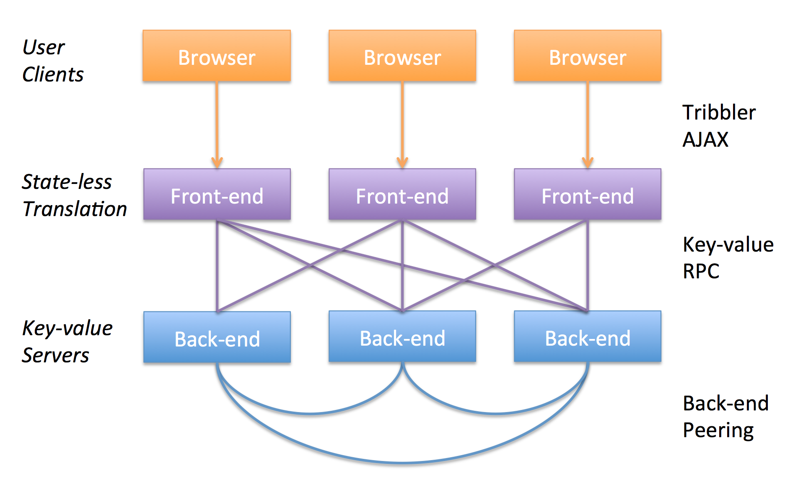
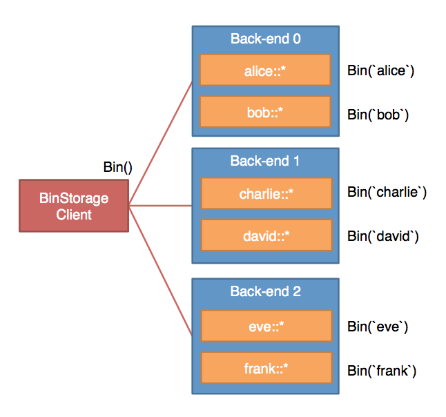

## Lab 2

Welcome to Lab 2. The goal of this lab is to use the RPC service
we built in Lab 1 as the basis to impelement a scalable Tribbler infrastructure,
split into separate front-ends and back-ends.

In particular, you will do this by first wrapping the key-value server into a
distributed key-value service called *bin storage*. Your implementation should
fit the `trib.BinStorage` interface. Then, on top of this storage layer, you
will implement a stateless Tribbler front-end that fits the `trib.Server`
interface.

## Get Your Repo Up-to-date

First we need to update the `trib` repo to pull down any recent changes that we
(the instructors) may have made:

```
$ cd ~/gopath/src/trib
$ git pull origin master
```

This should be painless, but if you changed anything in the `trib` repo, you'll
need to merge the changes by hand. As a reminder, changes to the `trib` repo
aren't necessary, and you shouldn't be doing them.

You'll also want to merge in any changes from the `triblab` repo. Hopefully,
this will also be painless, as we don't (as of this writing) expect any
changes.

```
$ cd ~/gopath/src/triblab
$ git pull origin master
```

If you have trouble on merging the changes (on any of the repos), and don't know
how to solve the conflicts, please ask the TA for help.

## System Architecture

The overall system architecture looks like this:



Our system is split into two parts. The upper part is the Tribbler service. The
lower part is a general purpose distributed key-value store called "Bin
Storage". Users' web browsers make AJAX calls to the Tribbler front-ends. These
front-end servers then convert those requests into one or more calls to the bin
storage client interface. This interface then uses RPC to talk to one or more of
the simple key-value stores that we built in Lab 1.

Separately, there is also a `keeper` running in the background that maintains
the bin storage in a coherent state. Both the bin storage clients and the keeper
use the same RPC interface (the one developed in Lab 1) to communicate with the
back-ends. The interface semantics defined in `trib.Storage` should be
sufficient to perform all the bin storage tasks without any changes.

## Bin Storage

**Bin Storage** is a distributed key-value system that combines a bunch of
`trib.Storage` back-ends and presents itself as a unified and scalable storage
service over the network. Bin storage service is provided via the
`trib.BinStorage` interface.

Conceptually, bin storage provides an infinite set of separate `trib.Storage`
instances called *bins*. Each bin has a different name, and a caller can fetch a
bin via the `BinStorage.Bin()` function. This is the only function in the
`trib.BinStorage` interface. Initially, all bins are empty.

The bin storage service provides this service on top of a
finite set of back-end key-value stores (Lab 1). Each bin (a virtual KV store)
will be mapped to one of the key-value back-ends. Thus, this is a many-to-one
mapping, with multiple bins potentially sharing a single back-end. You will do
this by splitting the key space with prefixes (or suffixes) that encode the bin
names. As an example, the figure below shows a bin storage hashing 6 bins into 3
back-ends, where each bin is indicated with a different prefix. When a caller
calls `Get("some-key")` on the bin `"alice"`, for example, the bin storage
client translates this into a `Get("alice::some-key")` RPC call on back-end 0.



In addition to key-value stores in bins, the bin storage also maintains a
coarsely synchronized logical clock across *all* the bins, so items in different
bins can be reasonably ordered relative to each other. Since the back-ends are
"dumb", and do not talk to each other, this clock synchronization is a job for
the background keeper process. Note that the clocks are NOT real-time
synchronized (which would be too expensive for a distributed system), but only
coarsely synchronized. In particular, if a `Clock()` call is issued at least 3
seconds after another `Clock()` call, no matter which bins they are issued in,
bin storage always guarantees that the later call always returns a clock value
no smaller than the earlier one's. Note that a bin storage with one single
back-end will trivially satisfy this requirement. The keeper's job comes in when
there are multiple back-ends to keep in sync.

As mentioned, we already implemented the back-end for Lab 1, and the key-value
store API will not change. Both the bin storage client and the keeper will
communicate with the "dumb" back-ends via the RPC calls we implemented, and
cooperatively they will present a coherent bin storage interface to upper layer
applications. Since we'll be reusing the work from Lab 1, make sure you've
implemented the back-end correctly!

## Tribbler

Before we look into how the Tribbler service works, let's first define what a
tribble is.

A `Tribble` is a Go structure that has 4 fields:

```
type Trib struct {
    User    string    // who posted this trib
    Message string    // the content of the trib
    Time    time.Time // the physical timestamp
    Clock   uint64    // the logical clock
}
```

`Time` is a real-world timestamp, read from the machine's time on the front-end
immediately after `Post()` is called on a `trib.Server`. In order to sort
tribbles in a globally consistent and *reasonable* order, however, we cannot
sort the tribbles only by this timestamp, as different front-ends may have
different clocks. For sorting, the Tribbler service uses a distributed logical
`Clock` in `uint64`.

When sorting many tribbles into a single timeline, you should sort by
the fields following this priority:

 1. `Clock` The logical timestamp.
 2. `Time` The physical timestamp.
 3. `User` The user id.
 4. `Message` The message content.

We call this the *Tribble Order*.

## Tribbler Service Interface

The Tribbler service logic is defined by the `trib.Server` interface (in
`trib/trib.go`). This is how the web user interface interacts with a Tribbler
server.

**************

```
SignUp(user string) error
```

Creates a new user. After a user is created, it will never disappear
in the system.

Returns error when the username is invalid or the user already exists.
If there are concurrent sign-ups, both sign-ups may succeed.

Valid usernames must be no longer than `trib.MaxUsernameLen=15`
characters but not empty, must start with a lower-case letter, and can
only contain lower-case letters or numbers. There is a helper
function called `trib.IsValidUsername(string)` which you can use to
check if a username is valid.

***

```
ListUsers() ([]string, error)
```

Lists at least `trib.MinListUser=20` different registered users. When
there are less than 20 users that have ever signed up, list all of
them. The returned usernames should be sorted in alphabetical order.

This is just for showing some users on the front page; this is not for
listing all the users that have ever signed up, as that would be
too expensive in a large system.

***

```
Post(who, post string, clock uint64) error
```

Posts a tribble. `clock` is the maximum clock value this user client has ever
seen (from reading tribbles via `Home()` or `Tribs()`). It returns error when
the user does not exist or the post is too long (longer than
`trib.MaxTribLen=140`).

***

```
Tribs(user string) ([]*Trib, error)
```

Lists the recent `trib.MaxTribFetch=100` tribbles that a user posted.
Tribbles needs to be sorted in the Tribble Order, and also in the same order
that the user posted the tribbles.

***

```
Follow(who, whom string) error
Unfollow(who, whom string) error
IsFollowing(who, whom string) (bool, error)
Following(who string) ([]string, error)
```

These are functions to follow/unfollow, check following and listing
all following users of a user. Users can never follow/unfollow
themselves. When calling with `who` equal to `whom`, the functions
must return an error. When the user does not exist, the functions return
an error. If a user performs a `Follow()` on another user over multiple
clients concurrently, only one `Follow()` should succeed with no errors.

A user can follow at most `trib.MaxFollowing=2000` users. When a user tries to
follow more than `trib.MaxFollowing=2000` users, `Follow()` should return an
error.

***

```
Home(user string) ([]*Trib, error)
```

List the recent `trib.MaxTribFetch=100` tribbles that are posted on the user's
timeline in Tribble Order. In addition, the ordering should always satisfy the
following conditions:

 1. If tribble A is posted after tribble B, and they are both posted by the same
    user, A always shows after B.
 2. If tribble A is posted at least 10 seconds after tribble B,
    even if they are posted by different users, A always shows after B.
 3. If tribble A is posted after a user client sees tribble B, A
    always shows after B.

A is *posted after* B means B calls `Post()` after A's `Post()` has returned.

The function returns error when the user does not exist.

***

In addition to normal errors, these calls might also return IO errors if the
implementation is unable to communicate with a remote service. Returning a nil
error means that the call is successfully executed; returning a non-nil error
means that the call may or may not have successfully executed (depending on
when/where the error occurred).

Note that the `trib/ref` package contains a reference implementation for
`trib.Server` (which you played with briefly in the lab setup).

## Entry Functions

Your job for Lab 2 is two-fold.

  1. Implement the bin storage service by implementing the bin storage client
     logic (the `NewBinClient()` function) and the keeper (the `ServeKeeper()`
     function).
  2. Reimplement the Tribbler service by translating all the Tribbler service
     calls into bin storage service calls (the `NewFront()` function).

You can find these entry functions in `lab2.go` file under `triblab`
repo:

```
func NewBinClient(backs []string) trib.BinStorage
```

This function is similar to `NewClient()` in `lab1.go` but instead returns a
`trib.BinStorage` interface. `trib.BinStorage` has only one function called
`Bin()`, which takes a bin name and returns a `trib.Storage`. A bin storage
provides another layer of mapping, where the caller will first gets a key-value
store (the bin) with a name and then performs calls on the returned store.
Different bin names should logically return completely separate key-value
storage spaces, even though multiple bins might share a single physical back-end
store.

For your convenience, we have provided a small package called `trib/colon`
which you can use for escaping all the colons in a string. The
escaping rule is simple, all `'|'` characters are escaped into `"||"`, and
all `':'` characters are escaped into `"|:"`. Please use this package
wisely.

***

```
func ServeKeeper(b *trib.KeeperConfig) error
```

This function is a blocking function, similar to `ServeBack()`. It will spawn a
keeper instance that maintains the back-ends in a bin store in consistent state.
For Lab 2, there will be only one keeper and the keeper won't have a lot to do.
In Lab 3 we'll be adding fault tolerance. Then, there will be multiple keepers,
   and they will handle maintaining consistency as back-ends die and rejoin.

(Note: A blocking function in this context means that it will never return
under normal operation. If it does return, it will be because it experienced an
error. If you implemented `ServeBack()` in Lab 1 with something like `go
http.Serve(...)`, you should go back and fix it before continuing.

The `trib.KeeperConfig` structure contains all the information needed on
back-ends, and also some additional information about other keepers which you
can ignore until Lab 3:

- `Backs []string`: This is the complete list of addresses to back-ends that the
  keeper needs to maintain.
- `Keepers []string`: This is the list of addresses for keepers. Lab 2 will
  have only one keeper; Lab 3 will always have least three keepers, but for now
  you can ignore this field.
- `This int`: The index of this keeper (in the `Keepers` list). For
  Lab 2, this will always be zero.
- `Id int64`: A non-zero incarnation identifier for this keeper, indicating when
  this keeper was created relative to other keepers. For Lab 2, you may ignore
  this field.
- `Ready`: A ready signal channel. It works similarly to the `Ready` channel in
  `trib.BackConfig` from Lab 1. When a keeper sends `true` on this channel, the
  distributed bin storage should be ready to serve. Therefore, if you need to
  initialize the physical back-ends in some way, make sure you do it before you
  send a signal over `Ready`. Don't forget to send `false` to `Ready` if the
  initialization fails.

You can add whatever functionality you want to the keeper, so long as it is
limited to maintaining the integrity and consistency of the bin storage, and the
setup is limited to the three `NewBinClient()`, `ServeBack()` and
`ServeKeeper()` calls. In particular, since the keeper is logically part of the
bin storage service, it may understand how a bin storage client translates keys.
It should NOT rely on anything specific to Tribbler.

Although an address for each keeper is given in the `Keepers` field, your keeper
does not necessarily need to listen on the address given. The keeper
address serves more like a unique keeper identifier, and identifies that a
keeper should be running on a given machine.

***

```
func NewFront(s trib.BinStorage) trib.Server
```

This function takes a bin storage structure, and returns an implementation of
`trib.Server`. The returned instance then will serve as a service front-end that
takes Tribbler service requests, and translates them into one or more calls to
the back-end key-value bin storage. This front-end should be stateless,
concurrency safe, and ready to be killed at any time. This means that at any
time during its execution on any call, the back-end key-value store always needs
to stay in a consistent state. Also, note that one front-end might be taking
multiple concurrent requests from the Web, and there might be multiple
front-ends talking to the same back-end, so make sure your system handles all
the concurrency issues correctly.

Note that your tribbler service should not rely on any special features that you
added to your bin storage client. In particular, we should be able to swap out
your `trib.BinStorage` for our own, and your Tribbler front-end should be
perfectly happy (and none the wiser). In particular, this means that you cannot
rely on the bin storage keeper to perform Tribbler related tasks. A front-ends
may spawn additional background go routines if additional work is required by
your implementation.

## Putting the pieces together

Your first step should be to write the bin storage service. Since we might have
multiple parts running at the same time, potentially on different machines, we
need a configuration file that specifies the serving addresses of the back-ends
and the keeper for the distributed bin storage. By default, the system expects
a file named `bins.rc`.

`bins.rc` is saved in JSON format, marshalling a `RC` structure type (defined in
`trib/rc.go` file). We have a utility program called `bins-mkrc` that can
generate a `bins.rc` file automatically.

Find a directory to use as your working directory (like `triblab`), then run:

```
$ bins-mkrc -local -nback=3
```

This will generate a file called `bins.rc` under the current directory, and also
print the file content to stdout. `-local` means that all addresses will be on
`localhost`. `-nback=3` means there will be in total three back-end servers. If
you remove `-local`, then it will generate back-end servers starting from
`169.228.66.143` and going up to `169.228.66.152`, which are the IP address of
our test machines. For `bins-mkrc`, there can be at most 10 back-ends and 10
keepers (since we only have 10 lab machines). However, you are free to create
your own `bins.rc` file that has more back-ends and keepers. For now, we'll use
3 back-ends and 1 keeper (the default value for `-nkeep`).

With this configuration file generated, we can now launch the back-ends:

```
$ bins-back
```

This will read and parse the `bins.rc` file, and spawn all the back-ends that
have serving address on this host. Since all the back-ends we generate here are
on `localhost`, all three will be spawned with this command, each in its own
goroutine. You should see three log lines showing that three back-ends started,
but listening on different ports. Aside from reading its task from the
configuration file, `bins-back` isn't much different from the `kv-serve`
program. You can also specify the back-ends you'd like to start directly by
providing command-line flags. For example, you can run the following to start
only the first two back-ends:

```
$ bins-back 0 1
```

By the way, by spawning multiple servers in a single process, this program does
a good job of demonstrating why we didn't want to use `rpc.DefaultServer` in Lab
1.

After the back-ends are ready, we can now start the keeper.

```
$ bins-keeper
```

This process should print a message that shows that the bin storage is ready to
serve.

To play with this distributed bin storage, we can use `bins-client`:

```
$ bins-client
(working on bin "")
> bin a
(working on bin "a")
> get a

> set a b
true
> get a
b
> bin t
(working on bin "t")
> get a b

> bin a
(working on bin "a")
> get a b
b
...
```

This program reads the back-end addresses from `bins.rc` and can
switch between different bins with the `bin` command. Otherwise, it operates
similarly to `kv-client` from the previous lab. The default bin is the bin named
"".

Once our bin storage is up and running, we can launch our
Tribbler front-end:

```
$ trib-front -init -addr=:rand -lab
```

You have used this utility before. The only new thing here is the `-lab` flag,
which tells it to read the `bins.rc` file and use our lab implementation. This
will start a stateless front-end (which you implemented in this lab) that
connects to the back-ends specified in `bins.rc`.

Again `-init` will populate the service with some sample data.

Now you can open your browser, connect to the front-end machine and play with
your own implementation.

If you want to use some other configuration file, use the `-rc` flag. It is
supported in all the utilities above.

Again, once you've completed this lab, your Tribbler implementation should be
able to support multiple front-ends and multiple back-ends in a nice, scalable
(but not fault-tolerant) way.

## Assumptions

For this lab, there are a number of simplifying assumptions we'll be making.
Some of these assumptions are reasonable. Many of the rest we'll remove in Lab
3:

- No network communication errors will occur.
- Once a back-end or a keeper starts, it will remain online forever.
- The system will always start in the following order: the back-ends, the keeper,
  then all the front-ends.
- The `trib.Storage` used in the back-end will return every `Clock()` call in
  less than 1 second.
- In the `trib.Storage` used in the back-end, all IO on a single process are
  serialized (and hence the interface provides sequential consistency). Each
  visit to a key (e.g. checking if a key exist, locating its corresponding
  value, iterating over a number of keys) will take less than 1 millisecond.
  Reads and writes of 1MB of data or less as a value (in a list or a string)
  will take less than 1 millisecond. Note that `Keys()` and `ListKeys()` might
  take a longer time to complete because it needs to scan over all the keys.
- All the front-ends, the back-ends and the keeper will be running
  on the lab machines.
- Although the Tribbler front-ends can be killed at any time, the killing won't
  happen very often (less than once per second).

Again, some of these assumptions won't stay true for Lab 3, so try to avoid
relying on these assumptions if possible.

## Requirements

In addition to the requirements specified by the interfaces, your
implementation should also satisfy the following requirements:

- When the Tribbler service function call has valid arguments, the
  function call should not return an error.
- The front-end should be stateless and hence safe to be kill at anytime.
- The back-ends should be scalable, and the front-end should use the back-ends in a
  scalable way. This means that when the back-end is the throughput bottleneck,
  adding more back-ends should (with high probability) mitigate the bottleneck
  and lead to better overall system performance.
- When running on the lab machines with more than 5 back-ends
  (assuming all the back-ends satisfy the performance assumptions), every
  Tribbler service call should return within three seconds. Ideally much less than
  this.
- Each back-end should maintain the same key-value pair semantics as in Lab 1.

As a result, all test cases that pass for Lab 1's storage implementation should
also pass on your bin storage implementation for Lab 2.

## Building Hints

While you are free to build the system any way that meets the requirements, here
are some suggestions:

- For each service call in the front-end, if it updates anything in
  the back-end storage, use only one write-RPC call to commit your change.
  This will make sure that the call will either succeed or fail, and not end up
  in some weird intermediate state.
  You might issue more write calls afterwards, but those should be
  only soft hints, meaning that if subsequent writes don't succeed, the storage
  system is not left in an inconsistent state.
- Hash the tribbles and other information into all the back-ends based
  on username. You may find the package `hash/fnv` helpful for
  hashing.
- Synchronize the logical clocks among all the back-ends every second.
  (This will also serve as a heart-beat signal, which will be useful
  for implementing Lab 3.) However, you should not try to synchronize
  the clocks for every post, because that will be not scalable.
- Do some garbage collection when one user has too many tribbles saved in the
  storage. Recall that no one will ever see more than the most recent 100
  tribbles by any other user.
- Keep multiple caches for the ListUsers() call when the users are many. Note
  that when the user count is more than 20, you don't need to track new
  registered users anymore.
- Keep a log for the users that a user follows, where each log
  entry is an action of `Follow()` or `Unfollow()`.

## Possible Mistakes

Here are some possible mistakes that a lazy and quick but incorrect
implementation might do:

- **Read-modify-write**: As an example, a tribbler might read a counter
  from the key-value store, increment it by one, and then write it back
  (at the same key). This will introduce a race condition among the front-ends.
- **Not handling errors**: A tribbler call might require several RPC calls to
  the back-end. It is important to properly handle *any* error returned by these
  calls. It is okay to tell the user that an error occurred. However, it's not a
  good plan to leave your back-end inconsistent.
- **Sorting by the timestamps first**: Again, the Tribble Order dictates
  that the logic clock is the first field to consider on sorting.
- **Misusing the clock argument in Post()**: For example, you might directly use
  that argument as the new post's clock field.  Intuitively, the clock argument
  tells the *latest* tribble a user has seen (which might be 0 if the user
  hasn't seen any tribbles yet), hence the new posted tribble better have a
  clock value that is at least larger than the argument.  You might need to do
  more than increment it by one though.
- **Generating the clock from the timestamp**: While 64-bit clock can cover a
  very wide time range even in the unit of nanoseconds, you should keep in mind
  that the front-ends are running on different servers with arbitrary physical
  time differences. It is not wise to generate the logical *clock* from the
  physical *time*.
- **Not handling old tribbles**: Note that only the most recent 100 tribbles of
  a user matter. Not handling old tribbles might lead to worse and worse
  performance over time and eventually break your performance promises.

## `Readme.md`

Please include a `Readme.md` file. `Readme.md` should be a text file (ideally in
[Markdown](https://daringfireball.net/projects/markdown/syntax) format) that
describes how your system works at a high level. You should be able to describe
how your Bin Storage works in a few sentences, and Tribbler in a few more.

The purpose of this document is two-fold:
 - If your `Readme` is well written, it'll make my job of grading *considerably*
   easier.
 - An overview document forces you to think about your overall strategy, and
   forces you to try to find an elegant solution (that you can describe
   succinctly).
 
This `Readme` *will* count towards your grade, but *will not* be a significant
number of points overall. It's worth spending some time on, but NOT at the
expensive of good, working code. You'll primarily be graded on clarity and
coverage of the big ideas of your solutions.

## Turning In Your Code

First, make sure that you have committed every piece of your code into the
repository `triblab`. Then just type `make turnin-lab2` under the root of the
repository. It will generate a `turnin.zip` file that contains everything in
your git repository, and then it will copy that file to a place where only the
lab instructors can read it.

## Happy Lab 2!
